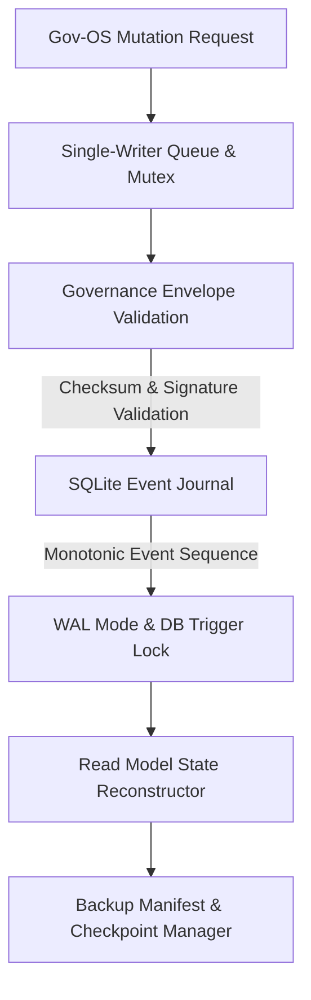

# 🏗️ System Architecture (v6.0 - Gov-OS Hardened)

The Parikshak system is a fully deterministic, rule-based evaluation and task-routing platform. It is designed as a Governed Operational System (Gov-OS) with strict system boundaries, immutable event-sourced state reconstruction, and human-in-the-loop validation constraints.

---

## 1. System Boundary Separation (Separation of Powers)

### 1.1 Sri Satya (Evaluation Engine)
- **Authority**: The sole component permitted to evaluate task submissions (PASS/FAIL) and assign failure types.
- **Independence**: Has no knowledge of the task graph, mapping, or routing logic.
- **Rules**: Executes 4 strict binary checks (Schema, Completeness, Logic, Integration).

### 1.2 Parikshak (Task Selector / Routing Engine)
- **Authority**: Traverses the pre-defined task graph (`db/niyantran_tasks.json`) to select the next task.
- **Constraint**: Must not perform scoring, evaluation, or infer failure types.
- **Inputs**: Accepts exactly `{ evaluation_result, failure_type, trace_id, submission_id }`.

---

## 2. Gov-OS Hardened Storage Layer

### 2.1 Immutable SQLite Event Journal
- **No Mutations**: Database triggers (`prevent_update_events`, `prevent_delete_events`) disallow `UPDATE` and `DELETE` operations on the `events` table.
- **Monotonic Sequence**: Every transaction increments a monotonic event sequence.
- **WAL Mode**: Write-Ahead Logging ensures concurrent read safety.

### 2.2 Replay Checkpoint & Rollback System
- **Deterministic Checkpoints**: Backup manifests store the exact database transaction sequence along with a cryptographic `state_hash` of the reconstructed read models.
- **Rollback Anchors**: System rollback can be executed to restore state up to any arbitrary sequence number by re-applying the event log.

### 2.3 Startup Safety Gate
Halts boot if the scanner detects any of the following 6 Gov-OS flags:
1. `HASH_MISMATCH`: Stored event hashes do not match computed hashes.
2. `ORPHAN_EVENT`: Events exist that cannot be linked to the parent chain.
3. `SEQUENCE_BREAK`: Non-monotonic sequence gaps in the database.
4. `SCHEMA_DRIFT`: Logged events fail frozen schema validation.
5. `SNAPSHOT_DIVERGENCE`: Reconstructed states do not match snapshot hashes.
6. `CHECKPOINT_MISMATCH`: Local database doesn't match backup manifest records.

---

## 3. Concurrency & Mutex Protection
- **Single-Writer Queue**: A synchronous mutex serializes write transactions, enforcing strict transaction order and preventing concurrency conflicts.

---

## 4. GPT Bridge Quarantine
- **Export-Only**: Allows exporting signed system snapshots.
- **No DB Mutation**: Imports must be converted to draft scaffolds awaiting manual operator verification and human governance approval before commit.
