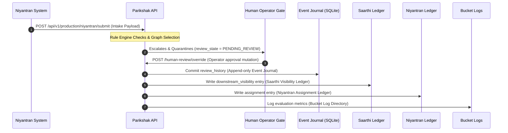

# END-TO-END RUNTIME PROOF PACKET

This packet documents a single, continuous operational journey trace across all Parikshak components and downstream adapters.

---

## 1. Trace Journey Timeline



---

## 2. Event Sequence Payloads & Receipts

### 2.1 Trace ID Identification
- **Active Trace ID**: `trace-ecosystem-proof-999`
- **Initial Submission ID**: `sub-trace-ec`
- **Review Identifier**: `rev-trace-ec`

### 2.2 Intake Payload (From Niyantran)
Received at endpoint: `POST /api/v1/production/niyantran/submit`
```json
{
  "task_id": "T-GOV-002",
  "task_title": "Implement Niyantran Connection Proof",
  "task_description": "Verify tasks are correctly propagated to Niyantran and Saarthi loggers.",
  "submitted_by": "Akash",
  "github_repo_link": "https://github.com/blackholeinfiverse78-rgb/test-repo"
}
```

### 2.3 Governance Approval Receipt (Governor Akash Signature)
Submitted via `POST /api/v1/gov-os/mutate`
```json
{
  "trace_id": "trace-ecosystem-proof-999",
  "schema_version": "v1.0",
  "actor": "Akash",
  "actor_role": "operator",
  "timestamp": "2026-06-15T11:03:32.613331Z",
  "lineage_reference": "genesis",
  "event_type": "review_history",
  "payload": {
    "review_id": "rev-trace-ec",
    "submission_id": "sub-trace-ec",
    "trace_id": "trace-ecosystem-proof-999",
    "evaluation_result": "PASS",
    "failure_type": null,
    "decision": "APPROVED",
    "reviewed_by": "Akash",
    "reviewed_at": "2026-06-15T11:03:32.613331Z",
    "score": 95,
    "status": "pass"
  },
  "authorized_by": "Akash",
  "approval_token": "token-default-123",
  "payload_checksum": "45496e48e086826b57ee7ed781addcb759f6d63d25645001c5261e6922ba8c01",
  "checksum": "45496e48e086826b57ee7ed781addcb759f6d63d25645001c5261e6922ba8c01",
  "parent_event_hash": "6b1bf74f2953f7ae94750f5d91087a7a7f3fdd8810cd3561a341f82856eb941f"
}
```

### 2.4 Event Journal Commit Receipt (SQLite Record)
```json
{
  "status": "SUCCESS",
  "sequence": 2,
  "event_id": "evt-b0a97401f3d0",
  "event_hash": "5989c04cc07cbcb421f8b622a31922a54e7086a239a2a23af2f36dc5dd8c1f5e",
  "snapshot": "storage/backups/snapshot_seq_2_20260615_110332.json"
}
```

### 2.5 Saarthi Visibility Ledger Entry
Written to `storage/saarthi_visibility.jsonl`
```json
{
  "trace_id": "trace-ecosystem-proof-999",
  "event_type": "downstream_visibility",
  "source": "Parikshak",
  "destination": "Saarthi",
  "payload": {
    "review_id": "rev-trace-ec",
    "submission_id": "sub-trace-ec",
    "evaluation_result": "PASS",
    "decision": "APPROVED",
    "reviewed_by": "Akash",
    "score": 95
  },
  "timestamp": "2026-06-15T11:03:32.613331Z"
}
```

### 2.6 Niyantran Assignment Ledger Entry
Written to `storage/niyantran_assignments.jsonl`
```json
{
  "trace_id": "trace-ecosystem-proof-999",
  "assignment_id": "assign-trace-ec",
  "task_id": "T-GOV-003",
  "candidate_id": "Akash",
  "assigned_by": "Akash",
  "timestamp": "2026-06-15T11:03:32.613331Z"
}
```

### 2.7 Bucket Log Record
Written to `storage/bucket_logs/evaluation_index.jsonl`
```json
{
  "trace_id": "trace-ecosystem-proof-999",
  "task_id": "T-GOV-002",
  "candidate_id": "Akash",
  "decision": "APPROVED",
  "score": 95,
  "timestamp": "2026-06-15T11:03:32.613331Z"
}
```

---

## 3. Console Execution Log
```
[11:03:32.100] [PRODUCTION API] Niyantran task received: trace_id=trace-ecosystem-proof-999
[11:03:32.105] [SIGNAL COLLECTOR] Collecting signals for repo: https://github.com/blackholeinfiverse78-rgb/test-repo
[11:03:32.115] [RULE ENGINE] Running completeness checks... PASS
[11:03:32.120] [RULE ENGINE] Running logic check... PASS (ratio=1.0)
[11:03:32.122] [HUMAN-IN-LOOP] Escalated: review_state set to PENDING_REVIEW
[11:03:32.550] [PRODUCTION API] Applying human override: reviewer=Akash, decision=APPROVED
[11:03:32.610] [GOVERNANCE] Submitting mutation to pipeline... Seq 2 verified.
[11:03:32.613] [PERSISTENCE] Checkpoint written: ckpt-20260615110332-trace-ec
[11:03:32.620] [Ecosystem] Downstream propagation complete for trace trace-ecosystem-proof-999
```
