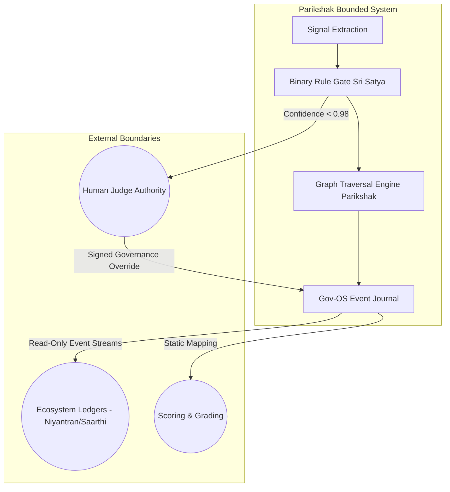

# Parikshak Ownership Boundary Map

This document establishes the boundaries of the Parikshak system, outlining what it owns versus what is delegated to other components, systems, or human authorities.

---

## 1. Summary of System Boundaries

---

## 2. Bounded Category Audits

### 2.1 Review (Task Submission Intake)
- **What Parikshak Owns**:
  - Validating input formats (FastAPI schemas).
  - Extracting keyword features and tech stack signatures from descriptions and text-based PDFs.
  - Crawling GitHub directories to parse counts, structures, and filenames.
  - Verifying the presence and markdown headers of the `REVIEW_PACKET.md` file.
- **What Parikshak DOES NOT Own**:
  - Deciding whether a repository contains correct business logic. The review is a shallow structure search.

### 2.2 Evaluation (PASS / FAIL Checks)
- **What Parikshak Owns**:
  - Applying 4 strict sequential binary checks (Schema, Completeness, Logic, Integration) on collected signals.
- **What Parikshak DOES NOT Own**:
  - AI or ML qualitative assessments. Evaluator heuristics and weights were explicitly deleted. It uses only hard-coded binary gates.

### 2.3 Scoring
- **What Parikshak Owns**:
  - Returning a static placeholder score (100 for PASS, 40 for FAIL, 0 for Schema Rejection) for compatibility reasons.
- **What Parikshak DOES NOT Own**:
  - Grading authority. It cannot compute grades (A, B, C) or adjust scores. All dynamic scoring code has been removed.

### 2.4 Recommendation
- **What Parikshak Owns**:
  - Formulating advisory text strings representing generic next-step directions.
- **What Parikshak DOES NOT Own**:
  - Dynamic skill mappings or career matching. Recommendations are static templates.

### 2.5 Assignment (Routing)
- **What Parikshak Owns**:
  - Selecting a follow-up task ID from `db/niyantran_tasks.json` by matching the `evaluation_result` and `failure_type`.
- **What Parikshak DOES NOT Own**:
  - Task generation. It cannot generate new tasks, write descriptions, or define custom assignments. It can only select from a frozen JSON registry.

### 2.6 Approval (Release Gate)
- **What Parikshak Owns**:
  - Staging the evaluation result as `PENDING_REVIEW` in `storage/product_state.json`.
- **What Parikshak DOES NOT Own**:
  - Releasing assignments. Parikshak cannot directly publish a task transition to active candidate queues. All releases require manual human signature verification.

### 2.7 Governance
- **What Parikshak Owns**:
  - Cryptographically verifying `GovernanceEnvelope` structures and payload checksums.
  - Rejecting database updates or deletes using SQLite database-level triggers.
- **What Parikshak DOES NOT Own**:
  - Establishing authority. Valid governors must be present in the hardcoded allowlist (`"Akash"`, `"Vinayak"`).

### 2.8 Judge Authority & Human Oversight
- **What Parikshak Owns**:
  - Computing a deterministic confidence metric.
  - Flagging cases with confidence score `< 0.98` and writing escalation cases to `storage/escalations`.
- **What Parikshak DOES NOT Own**:
  - Resolving exceptions. Human judges retain 100% authority to approve, reject, or override any task assignment.

### 2.9 Candidate Selection
- **What Parikshak Owns**:
  - Querying candidate profiles from the reconstructed database state.
- **What Parikshak DOES NOT Own**:
  - Choosing which candidate is assigned to a project initially. It handles follow-up routing only.

---

## 3. Authority Boundary Matrix

| Operational Action | Parikshak (System) Authority | Human Judge / Governor Authority |
|---|---|---|
| **Input Signal Extraction** | Fully Automated (Crawls GitHub/PDF) | None |
| **Pass/Fail Evaluation** | Automated via Binary Gates | Can override evaluation outcomes |
| **Score Assigning** | None (Static placebo constants only) | Retains scoring jurisdiction |
| **Task Selection** | Traverses pre-defined graph | Can manually override with any Task ID |
| **Task Release/Publishing** | **BLOCKED** (Cannot execute releases) | Enforces release sign-offs |
| **Database Mutations** | Append-only event journaling | Dual approval required for overrides |
