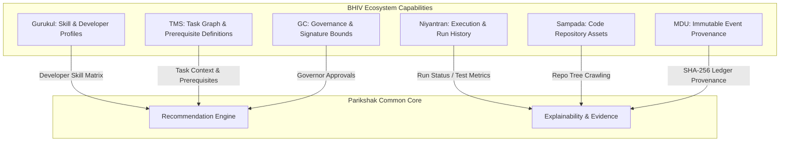

# PARIKSHAK ECOSYSTEM CAPABILITY MAP (V1)

This document maps the capabilities within the Blackhole Infiverse (BHIV) ecosystem that Parikshak will consume to deliver evidence-backed recommendations. Parikshak delegates database operations, developer skill progression profiling, and execution analysis to these systems instead of rebuilding them.

---

## 1. Summary of Ecosystem Integrations

---

## 2. Capability Contracts

### 2.1 Niyantran
*   **Owner**: Nikhil (Niyantran Integration)
*   **Purpose**: Extracts and registers task execution runs, test outputs, and candidate attempts.

| Capability | Input Contract | Output Contract | Current Availability | Integration Readiness | Authority Classification |
|---|---|---|---|---|---|
| **Run Execution Registry** | `candidate_id: str` `task_id: str` `git_commit_sha: str` | `run_status: str` `tests_total: int` `tests_passed: int` `build_output: str` `executed_at: ISO8601` | Operational | **Ready** via JSON/REST webhook endpoints | Ground Truth Execution Authority |
| **Execution History Retrieval** | `candidate_id: str` `limit: int` | `history: List[Dict]` (with past run outcomes and test results) | Operational | **Ready** via DB queries | Ground Truth History Ledger |

---

### 2.2 Sampada
*   **Owner**: Assets & Data Manager
*   **Purpose**: Provides structured access to submitted source code, documentation, and metadata assets.

| Capability | Input Contract | Output Contract | Current Availability | Integration Readiness | Authority Classification |
|---|---|---|---|---|---|
| **Code Repository Archival** | `repository_url: str` `branch: str` | `file_tree: Dict` `archive_url: str` `metadata: Dict` | Operational | **Ready** (direct integration with GitHub API or local crawlers) | Asset Vault |
| **Document Spec Extraction** | `task_id: str` | `pdf_content: str` `specifications: Dict` | Operational | **High** (PDF analyzer module exists in Parikshak) | Specification Source |

---

### 2.3 Gurukul
*   **Owner**: Soham (Gurukul Integration)
*   **Purpose**: Manages global candidate competence profiles, skill trees, and certifications.

| Capability | Input Contract | Output Contract | Current Availability | Integration Readiness | Authority Classification |
|---|---|---|---|---|---|
| **Developer Skill Profile** | `candidate_id: str` | `skills: Dict[str, float]` `certified_competencies: List[str]` `current_stage: str` | Partially Operational | **Medium** (requires synchronization with event log events) | Skill Grading Authority |
| **Competence Gap Mapping** | `skills: Dict[str, float]` `target_task_id: str` | `gap_ratio: float` `missing_skills: List[str]` | Conceptual | **Low** (requires collaborative development) | Profile Calibrator |

---

### 2.4 TMS (Task Management System)
*   **Owner**: TMS Role (Ecosystem Direction)
*   **Purpose**: Maintains the canonical task graph, metadata, and schedules.

| Capability | Input Contract | Output Contract | Current Availability | Integration Readiness | Authority Classification |
|---|---|---|---|---|---|
| **Canonical Task Definitions** | `task_id: str` | `title: str` `description: str` `difficulty: str` `prerequisites: List[str]` | Operational | **Ready** (uses frozen `niyantran_tasks.json` schema) | Assignment Definition Authority |
| **Project Milestones** | `project_id: str` | `milestone_tasks: List[str]` `priority: str` | Conceptual | **Medium** (requires alignment on schedules) | Strategy Planner |

---

### 2.5 GC (Governance Boundaries)
*   **Owner**: GC Role (Governance Constraints)
*   **Purpose**: Enforces human-in-the-loop limits, roles, and cryptographic approvals.

| Capability | Input Contract | Output Contract | Current Availability | Integration Readiness | Authority Classification |
|---|---|---|---|---|---|
| **Governor Signature Verification** | `governance_envelope: Dict` | `signature_valid: bool` `authorized_roles: List[str]` | Operational | **Fully Integrated** via `ConstitutionalValidator` | Constitutional Boundary |
| **Policy Exception Escalate** | `escalation_payload: Dict` | `escalation_id: str` `queue_status: str` | Operational | **Fully Integrated** via `storage/escalations` | Exception Queue |

---

### 2.6 MDU (Metadata Discipline Unit)
*   **Owner**: MDU Role (Canonical Data Discipline)
*   **Purpose**: Ensures database lineage, immutable hashing, auditability, and replay capability.

| Capability | Input Contract | Output Contract | Current Availability | Integration Readiness | Authority Classification |
|---|---|---|---|---|---|
| **Immutable Event Journaling** | `envelope: Dict` | `event_sequence: int` `event_hash: str` `commit_status: str` | Operational | **Fully Integrated** via SQLite database triggers | Provenance Ledger |
| **Snapshot Checkpointing** | `sequence_number: int` | `manifest_path: str` `state_hash: str` | Operational | **Ready** via `canonical_db/backup.py` | Reconstruction Manager |

---

## 3. Parikshak Consumption Strategy

Instead of maintaining independent databases for code runs, developer profiles, and static definitions, Parikshak will query the above systems dynamically:
1. **At Intake**: Parse the candidate's submission repository path using **Sampada**.
2. **At Evaluation**: Check test runner metrics using **Niyantran**.
3. **At Assignment**: Fetch the developer profile using **Gurukul** and lookup task prerequisites via **TMS**.
4. **At State Commit**: Route the final transaction details to **MDU** for immutable logging and check signatures with **GC**.
