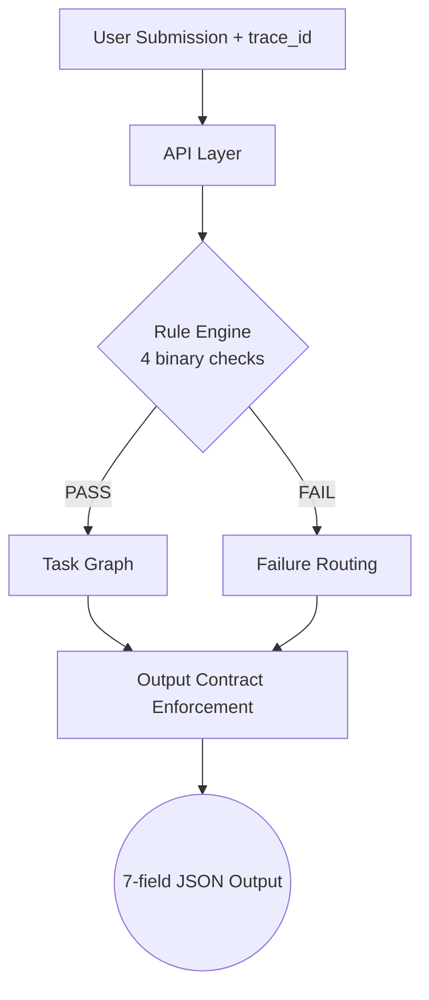

# Task Review Agent — Parikshak Production Evolution

## v1.0 — Deterministic Core (DFA Verified)
**STATUS: CORE LOCKED**

> **Parikshak** is a deterministic, rule-based engineering task evaluation engine that strictly maps submissions to next tasks without any numeric scoring, arbitrary weighting, or fallback routing. This system has been formally validated as a **Deterministic Finite Automaton (DFA)**.

### System Certification
- **Type**: Deterministic Finite Automaton (DB-driven)
- **Compliance**: Tantra Fully Compliant
- **Validation**: DFA Verified (10/10)
- **Core Status**: LOCKED (No logic mutations permitted)
- **Execution**: Unified, Boundary-Safe Pipeline

### Why Deterministic > Scoring Systems
Most evaluation systems rely on scoring, weights, or heuristics, which introduce ambiguity and inconsistency. Parikshak removes this by enforcing:
- **No ambiguity** (no arbitrary weights)
- **No drift** (identical inputs ALWAYS produce identical outputs)
- **No hidden logic** (everything is mapped in the DB)
- **Fully auditable decisions** (every failure type leads to an explicit graph node)

## System Overview (Quick Read)
Parikshak takes an engineering submission, strictly evaluates it against 4 binary rules, and deterministically routes it to the exact next task using a hard-coded graph database. It guarantees that the same input will always produce the exact same 7-field output contract.

## How It Works (Actual Flow)
```text
Submission (trace_id required) → Rule Engine (4 checks) → Task Graph → Output (Strict 7-field)
```



1. **Input**: A JSON submission containing `trace_id`, `task_id`, and submission data. **trace_id MUST be provided by upstream.**
2. **Rule Engine**: Evaluates 4 strict binary conditions (Schema, Completeness, Logic, Integration). First failure stops execution.
3. **Graph Traversal**: Routes the PASS/FAIL result to the exact `next_tasks` or `failure_tasks` mapped in the database.
4. **Output**: Returns a strict 7-field JSON contract. No exceptions.

---

## Architecture

### Architecture Ownership & Separation

**Evaluation Engine (Sri Satya) owns:**
- `rule_engine.py`: Single authority for PASS/FAIL
- `signal_engine.py`: SUPPORTING ONLY signals
- `validator.py`: Registry validation
- `review_packet_parser.py`: Hard gate for documentation

**Task Selector (Parikshak) owns:**
- `final_convergence.py`: Orchestrator and Contract Enforcement
- `niyantran_connection.py`: API Gateway and Determinism Logic

**Post-Processing Layers (Downstream only):**
- Decision Engine
- Human-in-Loop
- Bucket Logging
*(Note: These DO NOT affect task selection or the evaluation result.)*

### Execution Pipeline

```
Submission Input (JSON) -> trace_id MUST BE PRESENT
    |
    v
[Step 0] REVIEW_PACKET Hard Gate        <- review_packet_parser.py
    |  Missing / malformed -> FAIL, schema_violation
    v
[Step 1] Registry Validation            <- validator.py
    |  Invalid module_id / schema_version -> FAIL, schema_violation
    v
[Step 2] Signal Collection              <- signal_engine.py (SUPPORTING ONLY)
    |  Repo signals, feature match, title/desc signals — no evaluation authority
    v
[Step 3] Rule Engine                    <- rule_engine.py (SINGLE AUTHORITY)
    |  4 binary checks in strict order, first failure stops:
    |    Check 1: schema_validation    (repo OR word_count >= 50)
    |    Check 2: completeness         (code + proof + architecture + file_count >= 3)
    |    Check 3: logic_validation     (delivery_ratio >= 0.6 AND word_count >= 80)
    |    Check 4: integration          (repo accessible, metadata present)
    |  Output: evaluation_result = PASS | FAIL
    |          failure_type = schema_violation | incomplete | incorrect_logic | integration_fail
    v
[Step 4] Graph Traversal                <- engine/task_graph_engine.py
    |  PASS  -> task.next_tasks[0]
    |  FAIL  -> task.failure_tasks[failure_type][0]
    |  No fallback. Missing mapping -> HARD REJECT
    v
[Step 5] Output Contract Enforcement    <- final_convergence.py
    |  Exactly 7 fields enforced. Extra or missing -> CONTRACT_VIOLATION
    v
[Step 6] Bucket Logging                 <- bucket_integration.py
    |  Deterministic record of the evaluation and selection.
    v
Final Response — exact 7-field contract
```

---

## Output Contract (Strict 7 Fields)

The system enforces a strict JSON contract for every response:

```json
{
  "trace_id":          "trace-a3f2c1d48b9e4f2a",
  "submission_id":     "sub-eb2e07e7c652-d42768ed",
  "evaluation_result": "PASS",
  "failure_type":      null,
  "selected_task_id":  "T-GOV-002",
  "selection_reason":  "PASS -> next_tasks[0] = T-GOV-002",
  "source":            "task_graph"
}
```

- **NO extra fields permitted.**
- **NO missing fields permitted.**
- **trace_id is preserved from upstream.**

---

## Rule Engine — 4 Binary Checks

| Check | Failure Type | Criteria |
|---|---|---|
| **Schema** | `schema_violation` | FAIL if no repository AND word_count < 50 |
| **Completeness** | `incomplete` | FAIL if no code, no proof (README/tests), or file_count < 3 |
| **Logic** | `incorrect_logic` | FAIL if delivery_ratio < 0.6 OR low effort (word_count < 80) |
| **Integration** | `integration_fail` | FAIL if repo fetch error or metadata missing |

---

## Task DB — Schema

Every task in `db/niyantran_tasks.json` contains exactly 11 fields:

```json
{
  "task_id":            "T-GOV-001",
  "product":            "Niyantran",
  "layer":              "Governance",
  "subsystem":          "Task Review Engine",
  "capability":         "Submission Evaluation",
  "dharma":             "Ensure accurate evaluation.",
  "completion_signals": ["evaluation_api_returns_200"],
  "prerequisites":      [],
  "next_tasks":         ["T-GOV-002"],
  "failure_tasks": {
    "schema_violation": ["T-GOV-F01"],
    "incomplete":       ["T-GOV-F01"],
    "incorrect_logic":  ["T-GOV-F02"],
    "integration_fail": ["T-SYS-F00"]
  },
  "constraints":        ["no_numeric_scoring", "no_fallback_routing"]
}
```

---

## API Endpoints

| Method | Path | Description |
|--------|------|-------------|
| POST | `/api/v1/production/niyantran/submit` | Accept task from Niyantran (JSON) |
| GET | `/api/v1/production/niyantran/health` | Health check |
| GET | `/api/v1/production/bucket/logs` | Recent evaluation logs |

---

## Determinism Proof (BHIV)

System passes all 8 destructive tests:
1. **Submission ID**: 100% Deterministic (Pure function of input + trace_id)
2. **Restart Consistency**: Verified
3. **Contract Enforcement**: Exactly 7 fields, noise ignored
4. **Graph Hard Failure**: Non-existent mappings trigger immediate exceptions
5. **Trace Discipline**: Empty `trace_id` results in HARD REJECT
6. **No Hidden Logic**: Keyword-based domain routing is REMOVED
7. **Order Independence**: Input field shuffling does not affect output

---

## Tech Stack
- **Backend**: Python 3.11, FastAPI
- **Database**: Task Graph (JSON-based, 65 tasks)
- **Validation**: Strict Rule Engine + Contract Guard

---

## Running Locally

```bash
pip install -r requirements.txt
python -m uvicorn main:app --host 0.0.0.0 --port 8000
```
