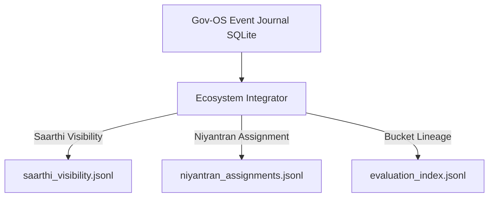

# Export Contract (Ecosystem Ledger Propagation Contract)

- **Version**: 1.0.0
- **Status**: FROZEN / CORE-LOCKED
- **Ownership Boundary**: Owned by `canonical_db/integration.py`.

---

## 1. Purpose
Defines the schema contracts and file formats for downstream ledger propagation. Once a governor commits a signed override/approval mutation into the SQLite Event Journal, Parikshak propagates the result to external target systems (Saarthi, Niyantran, and the Bucket evaluation service). No mock data is allowed; all payloads use real, verified signals.

---

## 2. Downstream Target Ledgers



---

## 3. Propagation Schemas

### 3.1 Saarthi Visibility Ledger Schema
- **Path**: `storage/saarthi_visibility.jsonl`
- **Format**: JSON Lines (.jsonl)
- **Record Fields**:
  - `trace_id`: String (from upstream)
  - `event_type`: Static value: `"downstream_visibility"`
  - `source`: Static value: `"Parikshak"`
  - `destination`: Static value: `"Saarthi"`
  - `payload`: Dict (contains score, status, failure reasons, and next task details)
  - `timestamp`: String (ISO-8601 UTC)

#### Sample Saarthi Record
```json
{
  "trace_id": "trace-ecosystem-proof-999",
  "event_type": "downstream_visibility",
  "source": "Parikshak",
  "destination": "Saarthi",
  "payload": {
    "review_id": "rev-trace-ec",
    "submission_id": "sub-trace-ec",
    "trace_id": "trace-ecosystem-proof-999",
    "evaluation_result": "PASS",
    "decision": "APPROVED",
    "score": 95,
    "readiness_percent": 95,
    "status": "pass",
    "candidate_name": "Akash"
  },
  "timestamp": "2026-06-12T08:35:00Z"
}
```

---

### 3.2 Niyantran Assignment Ledger Schema
- **Path**: `storage/niyantran_assignments.jsonl`
- **Format**: JSON Lines (.jsonl)
- **Record Fields**:
  - `trace_id`: String (from upstream)
  - `assignment_id`: String (Format: `"assign-{trace_id[:8]}"`)
  - `task_id`: String (Selected next task ID from the traversal engine)
  - `candidate_id`: String (Recipient candidate identifier)
  - `assigned_by`: String (Governor who authorized the release)
  - `timestamp`: String (ISO-8601 UTC)

#### Sample Niyantran Assignment Record
```json
{
  "trace_id": "trace-ecosystem-proof-999",
  "assignment_id": "assign-trace-ec",
  "task_id": "NT-ADV-I-001",
  "candidate_id": "Akash",
  "assigned_by": "Akash",
  "timestamp": "2026-06-12T08:35:00Z"
}
```

---

### 3.3 Bucket Lineage Log Schema
- **Path**: `storage/temp_bucket_logs/evaluation_index.jsonl`
- **Format**: JSON Lines (.jsonl)
- **Record Fields**: Logged via `bucket_integration.log_evaluation()` using the evaluation pipeline output metrics.

---

## 4. Failure States
- **File System Locking / Full Disk**: If writing to `.jsonl` files fails, the system rolls back the SQLite transaction to ensure downstream-state parity.
- **Out-of-Sync Downstream**: If propagation is interrupted, the export endpoint (`/api/v1/gov-os/export`) allows consumers to query the complete database hash sequence to check for missed logs.

---

## 5. Versioning Rules
- Schema mutations require a bump of `schema_version` inside the payload. Adding targets or destination routes requires minor version upgrades.

---

## 6. Compatibility Rules
- Downstream parsers must ignore unrecognized JSON fields in the ledger records to maintain forward compatibility.

---

## 7. Ownership Boundary
- **Parikshak Boundary**: Formulates payloads, writes ledger lines, and handles local locks.
- **Consumer Boundary**: Consumers must tail the log files or periodically fetch via API without modifying ledger contents.
