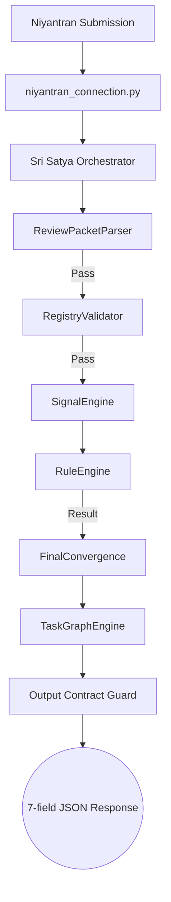

# 🏗️ System Architecture (v6.0)

The Parikshak-Niyantran system is a fully deterministic, rule-based evaluation and task-routing platform. It eliminates numeric scoring and heuristics in favor of strict binary rules and a pre-defined task graph.

---

## 1. System Boundary Validation

The system enforces a strict separation between evaluation (authority) and routing (execution).

### 1.1 Sri Satya (Evaluation Engine)
- **Primary Responsibility**: Computes `evaluation_result` (PASS/FAIL) and `failure_type`.
- **Authority**: The ONLY component allowed to perform scoring or evaluation.
- **Independence**: Has zero knowledge of the task graph, mapping, or traversal logic.

### 1.2 Parikshak (Task Selector)
- **Primary Responsibility**: Mapping results to nodes and performing graph traversal.
- **Constraint**: MUST NOT perform evaluation or infer failure types.
- **Inputs**: Accepts exactly `{ evaluation_result, failure_type, trace_id, submission_id }`.

---

## 2. Core Components

### 2.1 Rule Engine (`evaluation_engine/rule_engine.py`)
Deterministic binary rule resolver. Runs 4 checks in strict order:
1. **Schema Check**: Validates minimum description length and repository presence.
2. **Completeness Check**: Verifies presence of code, proof (README/tests), and architecture signals.
3. **Logic Check**: Validates effort (word count) and delivery alignment.
4. **Integration Check**: Verifies repository accessibility and metadata.

### 2.2 Graph Engine (`engine/task_graph_engine.py`)
Stateless graph traversal utility.
- Loads `db/niyantran_tasks.json`.
- Traverses from `current_task_id` based on result.
- PASS → `next_tasks[0]`
- FAIL → `failure_tasks[failure_type][0]`

### 2.3 Final Convergence (`task_selector/final_convergence.py`)
The system orchestrator.
- Calls Sri Satya for evaluation.
- Calls TaskGraphEngine for routing.
- Enforces the **7-field Output Contract**.
- Triggers **Bucket Logging**.

---

## 3. Data Flow

---

## 4. Determinism Guards

1. **Upstream Trace ID**: The `trace_id` is never generated internally. It must come from Niyantran. Missing ID = HARD REJECT.
2. **Deterministic Submission ID**: Generated as `sub-{content_hash}-{attempt_hash}` using MD5 on task metadata + trace_id.
3. **No Randomness**: No use of `uuid.uuid4()`, `random`, or `time.time()` in the decision path.
4. **Pure Mapping**: No keyword-based domain routing or keyword-guessing in graph selection.

---

## 5. Output Contract (EXACT)

Every successful response contains exactly these 7 fields:
1. `trace_id`: The original ID from upstream.
2. `submission_id`: The deterministic submission hash.
3. `evaluation_result`: "PASS" or "FAIL".
4. `failure_type`: Valid enum or `null`.
5. `selected_task_id`: The next task ID from the DB.
6. `selection_reason`: Traceable string explaining the route.
7. `source`: Always "task_graph".

---

## 6. Storage Layer

- **Bucket Logs**: Every evaluation is logged to `storage/bucket_logs/evaluations_{date}.jsonl`.
- **Format**: JSONL (JSON lines) for high-performance append-only auditing.
- **Searchable Index**: `evaluation_index.jsonl` maintained for rapid trace-id lookups.
