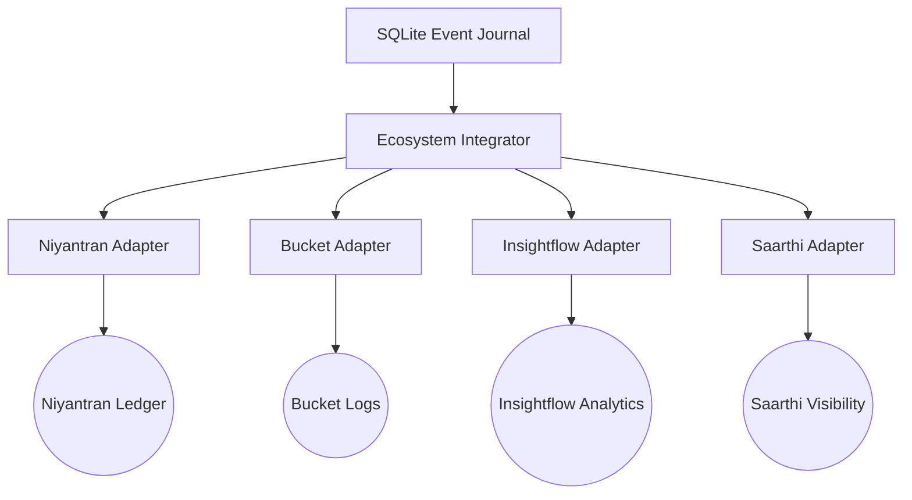

# 🔌 Ecosystem Integration Boundaries (Gov-OS Hardened)

Parikshak Gov-OS interacts with the broader Blackhole Infiverse ecosystem through isolated, read-only integration adapters.

---

## 1. Integration Philosophy

To maintain absolute database integrity and prevent split-brain states:
- **No Direct DB Mutation**: External services (e.g., Niyantran, Saarthi, Insightflow, Bucket) are forbidden from mutating the event journal.
- **Event-Driven Adaptation**: Integrations consume immutable, human-signed events produced by the Gov-OS transaction log.
- **Isolation**: Adapters run in isolated contexts, transforming and propagating event streams to their respective target systems.

---

## 2. Ecosystem Adapters (`/integrations/`)

The following adapters are defined and isolated in the `/integrations/` module:

### 2.1 Niyantran Adapter (`niyantran_adapter.py`)
- **Responsibility**: Listens for validated assignment events.
- **Action**: Registers human-approved tasks into the active Niyantran operational queue.
- **Safety Gate**: Verifies `HUMAN_APPROVED` metadata is present before processing.

### 2.2 Bucket Adapter (`bucket_adapter.py`)
- **Responsibility**: Tracks overall review and system events.
- **Action**: Converts internal audit records into standardised bucket execution logs (`storage/bucket_logs`).

### 2.3 Insightflow Adapter (`insightflow_adapter.py`)
- **Responsibility**: Observes task analysis payloads.
- **Action**: Feeds cognitive and performance insights into the Insightflow analytical ledger.

### 2.4 Saarthi Adapter (`saarthi_adapter.py`)
- **Responsibility**: Tracks developer performance and completion signals.
- **Action**: Enqueues data to Saarthi developer visibility ledgers for pipeline dashboard rendering.

---

## 3. Propagation Verification

All ecosystem propagation must be initiated via the Gov-OS integration path:
1. Submit human-approved mutation envelope.
2. The `EcosystemIntegrator` parses the committed event.
3. Event is safely written to the adapter's destination (e.g. JSONL ledgers).
4. No external write can bypass the single-writer queue or SQLite database triggers.
