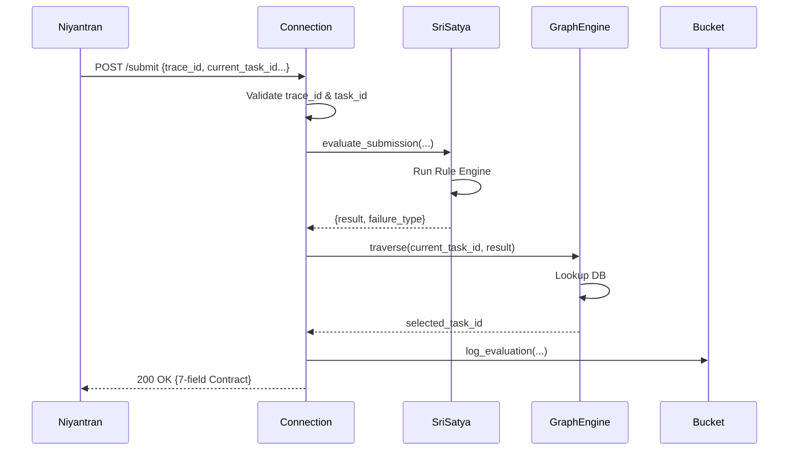

# Parikshak System Flow Documentation

**Version**: 4.0.0
**Status**: TRUE PASS (Deterministic)

---

## 1. Request Lifecycle

The system processes every Niyantran request through a single sequential pipeline.

### Step 1: Entry & Validation
- **Endpoint**: `POST /api/v1/production/niyantran/submit`
- **Component**: `task_selector/niyantran_connection.py`
- **Logic**:
    - Validates presence of `trace_id` (Min 8 chars).
    - Generates deterministic `submission_id`.
    - Validates `current_task_id` against Database.

### Step 2: Evaluation (Sri Satya)
- **Component**: `evaluation_engine/orchestrator.py`
- **Logic**:
    1. **Packet Parser**: Checks `REVIEW_PACKET.md` presence and format.
    2. **Registry Validator**: Checks `module_id` and `schema_version` against the Registry.
    3. **Signal Collector**: Gathers repository and description metadata (non-authoritative).
    4. **Rule Engine**: Runs 4 binary checks (Schema, Completeness, Logic, Integration).
- **Output**: `{ evaluation_result, failure_type, reason }`

### Step 3: Selection (Parikshak)
- **Component**: `task_selector/final_convergence.py`
- **Logic**:
    1. Receives evaluation output.
    2. Invokes `TaskGraphEngine` with `current_task_id` and the result.
    3. **Graph Engine**: Performs lookup in `db/niyantran_tasks.json`.
    4. Selects `next_tasks[0]` if PASS, or `failure_tasks[failure_type][0]` if FAIL.
- **Output**: `selected_task_id`

### Step 4: Contract Enforcement
- **Component**: `task_selector/niyantran_connection.py`
- **Logic**:
    - Strips all internal metadata.
    - Constructs exactly 7 fields.
    - Validates field names and counts.
- **Output**: Final JSON Response.

---

## 2. Sequence Diagram

---

## 3. Determinism Guarantees

| Process | Strategy | Result |
|---|---|---|
| **Submission ID** | `MD5(task_metadata + trace_id)` | Identical inputs → Identical IDs |
| **Evaluation** | Order-dependent binary rules | Identical signals → Identical PASS/FAIL |
| **Routing** | Static JSON-based mapping | Identical result → Identical Next Task |
| **Output** | Strict field stripping | No leakage of timestamps or random metadata |

---

## 4. Hard Failure Modes (Exceptions)

The system is designed to **FAIL LOUDLY** if deterministic constraints are violated:

1. **Missing trace_id**: `ValueError("NIYANTRAN_HARD_REJECT")`
2. **Task not in DB**: `ValueError("GRAPH_HARD_REJECT")`
3. **Invalid Routing Mapping**: `ValueError("GRAPH_HARD_REJECT")`
4. **Output Contract Violation**: `ValueError("CONTRACT_VIOLATION")`
5. **FAIL with null failure_type**: `ValueError("OUTPUT_CONTRACT_VIOLATION")`
