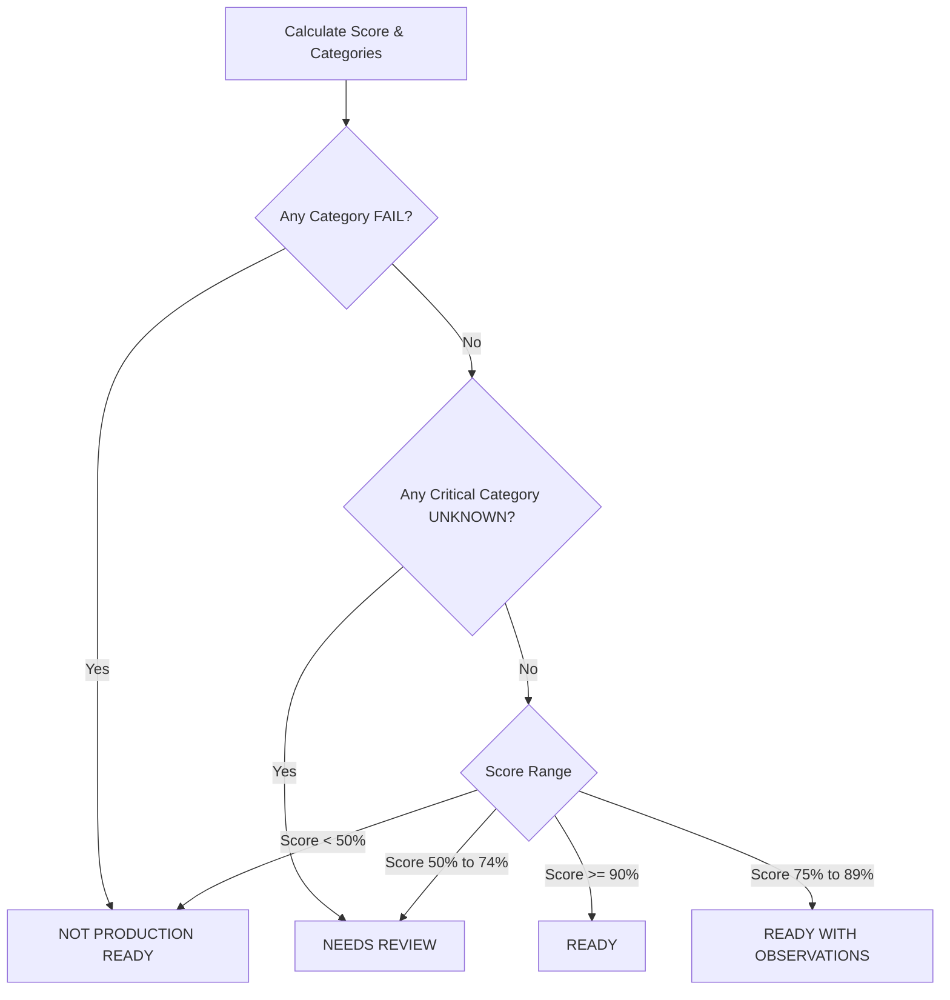

# BHIV Production Readiness Scoring Model

This document establishes the deterministic mathematical scoring rules and verdict trees used by the **Parikshak Production Readiness Certification Engine** to certify products within the BHIV/TANTRA ecosystem.

---

## 1. Category Definitions and Weight Allocations

The final score is a weighted combination of 11 distinct categories representing engineering discipline, operational robustness, and ecosystem alignment:

| Category | Weight ($W_c$) | Mandatory? | Primary Verification Source |
| :--- | :---: | :---: | :--- |
| **1. Runtime** | 10% | **Yes** | Pratham (`handover_bundle.json`), Shakti (`validation_decision.json`) |
| **2. Observability** | 10% | No | OpenTelemetry tracers, `observability_telemetry.json` |
| **3. Replay** | 10% | **Yes** | Pratham (`replay_bundle.json`), Shakti (`replay_verification.json`) |
| **4. Governance** | 10% | **Yes** | Shakti (`governance_record.json`, `validation_decision.json`) |
| **5. Security** | 10% | **Yes** | Vulnerability reports, signature verifications, dependency CVEs |
| **6. Recovery** | 5% | No | Checkpoints, rollback anchors count, restore proofs |
| **7. Versioning** | 5% | No | MDU (`schema_metadata.json`, `registration_reference.json`) |
| **8. Documentation** | 5% | No | Project README presence, architectural description signals |
| **9. Evidence** | 15% | **Yes** | Pratham (`evidence_bundle.json` checksum and hash matching) |
| **10. Integration** | 10% | No | Upstream/downstream mapping, dependency graph cycle checks |
| **11. Convergence**| 10% | **Yes** | TMS (`tms_convergence_status.json` registration matching) |

---

## 2. Mathematical Scoring Model

Let $C$ be the set of all 11 categories. Each category $c \in C$ is assigned a state:
- $\text{PASS} \implies S_c = 1.0$
- $\text{WARNING} \implies S_c = 0.5$
- $\text{FAIL} \implies S_c = 0.0$
- $\text{UNKNOWN} \implies S_c = 0.0$

The final Production Readiness Score ($S_{total}$) is calculated as:

$$S_{total} = \sum_{c \in C} \left( S_c \times W_c \right) \times 100\%$$

---

## 3. Verdict Decision Trees

The final verdict is derived from a strict, deterministic rule tree. It categorizes the system into one of five states:

### Detailed Decision Logic

1.  **READY**
    *   **Score Threshold**: $S_{total} \ge 90\%$
    *   **Conditions**:
        *   0 category results are `FAIL`.
        *   0 critical categories (Runtime, Replay, Governance, Security, Evidence, Convergence) are `UNKNOWN`.
    *   **Description**: The system is fully compliant and safe to join the live governed ecosystem.

2.  **READY WITH OBSERVATIONS**
    *   **Score Threshold**: $75\% \le S_{total} < 90\%$
    *   **Conditions**:
        *   0 critical categories are `FAIL`.
        *   Non-critical categories may be `WARNING` or `UNKNOWN` (e.g. minor documentation warning, missing optional recovery anchors).
    *   **Description**: The system is safe to proceed but should prioritize addressing the documented observations in its next deployment cycle.

3.  **NEEDS REVIEW**
    *   **Score Threshold**: $50\% \le S_{total} < 75\%$ OR any critical category is `UNKNOWN` (missing evidence).
    *   **Conditions**:
        *   No critical failure (`FAIL` in runtime or security), but incomplete provenance or governance records prevent deterministic automated approval.
    *   **Description**: Blocked from automated certification. Human operational override required to manually verify boundaries and logs.

4.  **NOT PRODUCTION READY**
    *   **Score Threshold**: $S_{total} < 50\%$ OR any category has a result of `FAIL`.
    *   **Conditions**:
        *   Any critical vulnerability, circular dependency, explicit governance rejection, or trace integrity hash mismatch instantly triggers this state.
    *   **Description**: Safe-fail protocol active. System is strictly rejected and prohibited from registering inside TANTRA.

5.  **UNKNOWN**
    *   **Conditions**:
        *   All metadata and bundle files are absent from the trace folder, leaving the verification service with zero signals.
    *   **Description**: Unable to reach a verdict due to complete absence of required artifacts.
