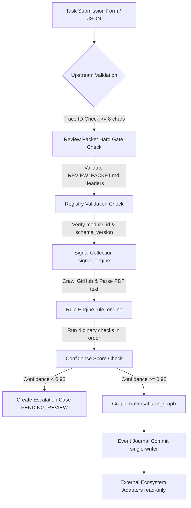

# Parikshak Capability Audit & Operational Reality Assessment (v1)

*   **Candidate Name**: Ishan Shirode
*   **Task Name**: Parikshak Capability Audit & Operational Reality Assessment (Parikshak – Capability Freeze Sprint)
*   **Version**: v6.0.0 (Hardened Gov-OS Core Locked)

---

## 1. Entry Point
The unified entry point for Parikshak execution is the `execution_pipeline.execute()` method in the Python codebase.
- **Source File**: [evaluation_engine/execution_pipeline.py](file:///c:/Users/black/Downloads/Live%20Task%20Review%20Agent%20-%202/Live%20Task%20Review%20Agent%20-%202/evaluation_engine/execution_pipeline.py)
- **API Endpoint**: `POST /api/v1/production/niyantran/submit` (routes directly to the pipeline).
- **Web UI Entry Route**: `POST /api/v1/lifecycle/submit` (accepts HTML form submissions and optional PDF files, then routes to `ReviewOrchestrator`).

---

## 2. Current Execution Flow
When a task submission is received, it follows a deterministic sequence:

1.  **Upstream Validation**: Verifies that a valid `trace_id` from Niyantran exists (min 8 chars).
2.  **Review Packet Gate**: Scans for `REVIEW_PACKET.md` and validates headers.
3.  **Registry Validation**: Checks `module_id` and `schema_version` against `context_registry.json`.
4.  **Signal Collection**: Gathers technical metadata from the GitHub repository and PDF files.
5.  **Rule Engine**: Executes the 4 checks (Schema, Completeness, Logic, Integration) in order.
6.  **Confidence & Escalation**: Calculates confidence score. If `< 0.98`, creates an escalation case and pauses routing.
7.  **Graph Traversal**: Selects the correction or advancement task from `db/niyantran_tasks.json`.
8.  **Commit**: Appends the mutation event to the SQL event journal.
9.  **Propagation**: Reads from the log and propagates data to external adapters.

---

## 3. Current Capabilities
*   **Shallow Repository Parsing**: Crawls directory trees, counts files, maps extension counts, and filters paths matching `'test'`, `'route'`, `'model'`, etc.
*   **Binary Rule Gates (Sri Satya)**: Evaluates file availability, README size, description length, and matching features.
*   **Task Graph Navigation (Parikshak)**: Routes candidates to next-step tasks based on binary outcomes.
*   **Boot Integrity Verification**: Verifies SHA-256 event chains and checksums at startup.
*   **Low-Confidence Escalation (Human-in-Loop)**: Captures edge cases with confidence score `< 0.98` and stages them for judge override.
*   **Cryptographic Write Protection**: Blocks updates/deletes in the SQL database using database triggers.

---

## 4. Current Limitations
*   **No Code Compilation/Execution**: The system does not compile or run candidate code.
*   **Ignored Verification Signals**: `FeatureMatcher` calculates language and architecture match ratios, but the `RuleEngine` completely ignores them during evaluation.
*   **In-Memory Storage Cap (1,000 limit)**: All submissions and reviews are maintained in-memory and serialized to a single flat JSON file. Old records are evicted once the total count exceeds 1,000.
*   **Shared Backups Verification Conflict**: The startup validator scans all backups. Temporary test databases writing to the shared `storage/backups` directory cause checkpoint mismatches, blocking application boot.

---

## 5. Demo Findings
During the HackaVerse demo, an **unrelated file** was uploaded and returned a `PASS` status.
- **Root Cause**:
  1. If the submission text contains none of the pre-defined technical keywords, the extracted list of expected features is empty (`[]`).
  2. The match ratio logic is computed as: `len(implemented_features) / len(expected_features) if expected_features else 1.0`. Thus, an empty list of requirements returns a default match ratio of `1.0` (100%).
  3. The `RuleEngine` interprets this as a perfect match, bypasses the logic check, and returns `PASS` as long as any 3 files exist in the repository.
- **Implication**: Candidates can submit dummy files or template repositories and easily pass evaluations.

---

## 6. Ownership Boundary
*   **What Parikshak Owns**:
    *   Evaluating submissions against binary rules and choosing next task IDs.
    *   Verifying event journal schemas and boot-time integrity.
    *   Flagging low-confidence escalations.
*   **What Parikshak DOES NOT Own**:
    *   Judge authority and task release decisions (every task release remains blocked in `PENDING_REVIEW` until human approval is received).
    *   Scoring decisions (the `scoring_engine.py` was deleted; it only outputs PASS/FAIL results).
    *   Initial candidate selection.

---

## 7. Integration Surface
*   **API Routes**:
    *   `POST /api/v1/production/niyantran/submit` (Niyantran task execution).
    *   `POST /api/v1/production/human-review/override` (Judge review override).
    *   `POST /api/v1/gov-os/mutate` (Appends event payload to SQL journal).
    *   `GET /api/v1/gov-os/export` (Exports state).
    *   `GET /api/v1/review/pending` (Gets pending review records).
*   **Event Schemas**:
    *   Entities: `candidate_profiles`, `task_lineage`, `review_history`, `assignment_history`, etc.
*   **Storage**:
    *   SQLite database (`canonical_db.sqlite`) for the event journal, and a flat JSON file (`product_state.json`) for active submission records.

---

## 8. Scale Readiness
*   **100 reviews**: **PROVEN** (fully supported; in-memory dict serialization is fast and SQLite WAL prevents locks).
*   **1,000 reviews**: **LIKELY** (supported, but write times slow down as the flat JSON file grows).
*   **5,000 reviews**: **NOT SUPPORTED** (storage layer evicts submissions above 1,000, and lock acquire contention delays writes).
*   **10,000 reviews**: **NOT SUPPORTED** (exceeds memory capacity, and boot scans block initialization).

---

## 9. Proof
*   **Diagnostics Proof**: The Gov-OS diagnostic suite runs successfully (12/12 PASS), proving immutable triggers and signature validations.
*   **Readiness Proof**: The production readiness suite (`production_readiness_test.py`) passes all 7 validation phases.
*   **Failure Proof**: Pytest returns errors on `test_memory_limit.py` and `test_production_readiness.py` because they attempt to connect to a local server on port 8000, indicating a test integration surface gap.

---

## 10. Open Questions
*   **Scoring Authority**: Since scoring logic has been removed and replaced with static Placebos (100 on PASS, 40 on FAIL), how should actual score grading be handled in the wider ecosystem?
*   **Storage Scale-Up**: What database server (e.g. PostgreSQL) is planned to replace the flat JSON storage layer to support deployments above 1,000 reviews?
*   **Language & Stack Constraints**: Should the rule engine enforce tech stack matches (`python` vs `javascript`) to prevent candidates from bypassing requirements?

---

## 11. Recommended Next Steps
1.  **Enforce Stack and Architecture Checks**: Modify `RuleEngine` to validate the `tech_stack_match` and `architecture_match` signals computed by `FeatureMatcher`.
2.  **Fix Empty Feature Bypass**: Prevent `expected_features` from defaulting to `1.0` match ratio when empty; require a minimum set of technical keywords to pass.
3.  **Migrate Storage**: Replace the in-memory flat JSON persistent store (`persistent_storage.py`) with a relational SQLite/PostgreSQL table to support over 1,000 reviews.
4.  **Isolate Backup Directories**: Configure `IntegrityValidator` to isolate snapshot folders by DB file name rather than scanning the entire shared `storage/backups` directory.
